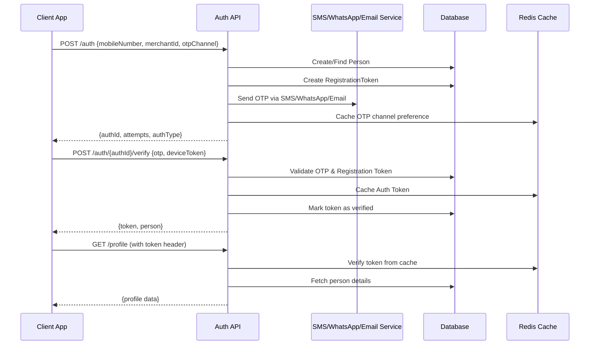
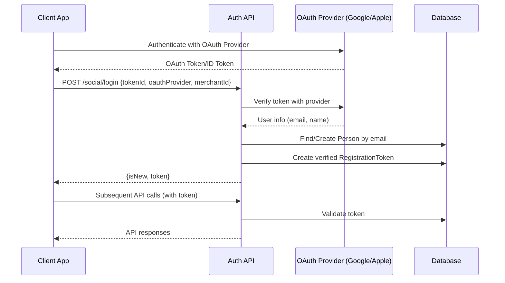
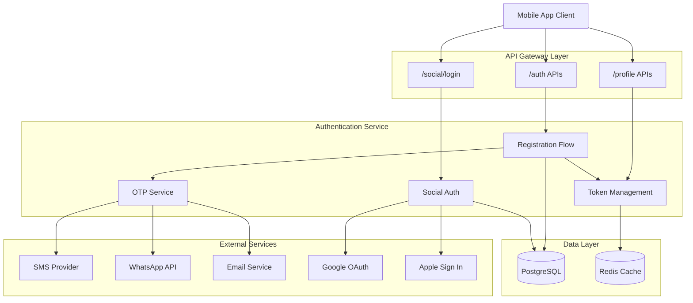
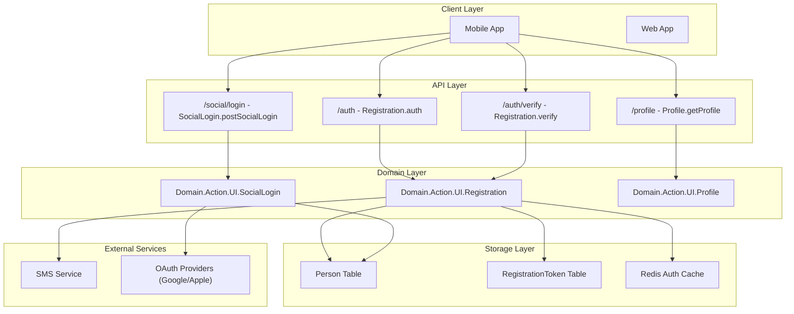

# 🔐 NammaYatri Authentication Architecture

A comprehensive guide to the authentication system powering the NammaYatri rider application.

## 📋 Table of Contents

- [Overview](#overview)
- [Authentication Flow](#authentication-flow)
- [API Endpoints](#api-endpoints)
- [Authentication Methods](#authentication-methods)
- [Social Login Integration](#social-login-integration)
- [Security Features](#security-features)
- [Technical Implementation](#technical-implementation)
- [Architecture Diagrams](#architecture-diagrams)

## 🎯 Overview

The NammaYatri rider app implements a robust, multi-layered authentication system supporting multiple authentication methods with comprehensive security features. The system is designed for high availability, security, and user experience.

### Key Features

- **Multi-channel OTP delivery** (SMS, WhatsApp, Email)
- **Social login integration** (Google, Apple Sign In)
- **Token-based authentication** with Redis caching
- **Rate limiting and fraud detection**
- **Encrypted data storage**
- **Signature-based authentication** for SDK integrations

## 🔄 Authentication Flow

### 1. OTP-Based Authentication Flow



### 2. Social Login Flow



## 🛠️ API Endpoints

### Core Authentication APIs

| Endpoint | Method | Description | Authentication Required |
|----------|--------|-------------|------------------------|
| `/auth` | POST | Initiate authentication process | ❌ |
| `/auth/{authId}/verify` | POST | Verify OTP and get auth token | ❌ |
| `/auth/signature` | POST | Signature-based authentication | ❌ |
| `/auth/logout` | POST | Clear tokens and logout | ✅ |
| `/auth/otp/{authId}/resend` | POST | Resend OTP | ❌ |

### Social Login APIs

| Endpoint | Method | Description | Authentication Required |
|----------|--------|-------------|------------------------|
| `/social/login` | POST | OAuth authentication | ❌ |

### Profile Management APIs

| Endpoint | Method | Description | Authentication Required |
|----------|--------|-------------|------------------------|
| `/profile` | GET | Get user profile | ✅ |
| `/profile` | PUT | Update user profile | ✅ |

## 🔐 Authentication Methods

### 1. Mobile Number + OTP (Primary)

**Supported Channels:**
- **SMS** (Default)
- **WhatsApp** 
- **Email**

**Flow:**
1. User enters mobile number
2. System sends OTP via selected channel
3. User verifies OTP
4. System issues authentication token

### 2. Email + OTP

**Use Case:** Alternative authentication method
**Flow:** Similar to mobile OTP but uses email address

### 3. Social OAuth

**Supported Providers:**
- **Google OAuth**
- **Apple Sign In (iOS)**

**Flow:**
1. User authenticates with OAuth provider
2. System validates OAuth token
3. Creates or links existing account
4. Issues pre-verified authentication token

## 🔗 Social Login Integration

### OAuth Provider Support

```typescript
enum OAuthProvider {
    Google = 'Google',
    IOS = 'IOS'
}
```

### Implementation Details

The social login system integrates with:

- **Google OAuth**: Uses Google Sign-In SDK
- **Apple Sign In**: Uses Apple Authentication framework
- **Token Validation**: Server-side verification with provider endpoints
- **Account Linking**: Email-based account creation/linking

### Social Login Hook

```typescript
const useSocialAuthValidation = () => {
    const socialAuthValidation = async (
        socialLoginRes: socialLoginRes,
        oauthResult: OAuthResult,
        verificationChannel: SocialVerificationChannel,
    ) => {
        // Handle social login validation
        // Set authentication token
        // Initialize user session
        // Navigate to appropriate screen
    };
};
```

## 🛡️ Security Features

### 1. Rate Limiting & Fraud Detection

- **Sliding window rate limiting** on authentication attempts
- **IP-based fraud detection** and blocking
- **Device token tracking** for security monitoring
- **Multiple OTP delivery channels** for high delivery rates

### 2. Data Encryption

- **AES-128 encryption** for sensitive signature auth data
- **Encrypted storage** of mobile numbers and emails
- **Secure token transmission** using HTTPS

### 3. Token Management

- **Redis-based token caching** for performance
- **Configurable token expiry** times
- **Automatic cache invalidation** on logout
- **Token validation** on each API request

## 🏗️ Technical Implementation

### Authentication State Management

```typescript
// Auth validation hook
const useAuthValidation = () => {
    const authValidation = async (
        authRes: authRes,
        phoneNumber: string,
        verificationChannel: VerificationChannel,
    ) => {
        // Set authentication token
        // Initialize user session
        // Update profile data
        // Handle navigation
    };
};
```

### Token Storage

```typescript
// MMKV storage for secure token persistence
setStringItem(MMKVKey.REGISTRATION_TOKEN, authRes.token ?? '');
setStringItem(MMKVKey.SESSION_KEY, JSON.stringify({
    email: authRes.person?.email,
    nextScreen: 'UpdateProfile',
    token: authRes.token,
}));
```

### Profile Management

```typescript
// Profile API integration
const userApi = api.injectEndpoints({
    endpoints: build => ({
        getProfile: build.query<profileRes, void>({
            query: () => ({
                url: '/profile',
                method: 'GET',
            }),
            // Handle profile data updates
            // Manage user session
            // Update analytics
        }),
    }),
});
```

## 📊 Architecture Diagrams

### System Architecture



### Authentication Flow Architecture



## 📝 Key Implementation Files

### Authentication Hooks
- `src/typescript/hooks/useAuthValidation.ts` - OTP authentication validation
- `src/typescript/hooks/useSocialAuthValidation.ts` - Social login validation

### API Integration
- `src/typescript/state/server/authApi.ts` - Authentication API endpoints
- `src/typescript/state/server/userApi.ts` - User profile API endpoints

### Authentication Screens
- `src/typescript/screens/onboarding/LoginScreen.tsx` - Main login screen

### Type Definitions
- `src/readOnly/api/types/AuthVerifyRes.res` - Authentication response types
- `src/readOnly/api/types/SocialLoginRes.gen.ts` - Social login response types

## 🚀 Getting Started

### Prerequisites

- React Native development environment
- Node.js and Yarn
- iOS/Android development tools

### Installation

```bash
# Install dependencies
cd consumer
yarn install

# iOS setup
cd ios && pod install && cd ..

# Run the app
yarn ios  # or yarn android
```

### Environment Configuration

Ensure the following environment variables are configured:

```bash
# Authentication endpoints
AUTH_BASE_URL=https://api.nammayatri.in
SOCIAL_LOGIN_ENABLED=true

# OAuth providers
GOOGLE_CLIENT_ID=your_google_client_id
APPLE_CLIENT_ID=your_apple_client_id
```

## 🔧 Configuration

### OTP Channel Configuration

```typescript
enum OTPChannel {
    SMS = 'SMS',
    WHATSAPP = 'WHATSAPP',
    EMAIL = 'EMAIL'
}
```

### Token Expiry Configuration

```typescript
const TOKEN_CONFIG = {
    AUTH_TOKEN_EXPIRY: 24 * 60 * 60, // 24 hours
    REGISTRATION_TOKEN_EXPIRY: 10 * 60, // 10 minutes
    CACHE_EXPIRY: 24 * 60 * 60 // 24 hours
};
```

## 📚 Additional Resources

- [Backend Architecture Documentation](https://github.com/nammayatri/nammayatri/wiki)
- [API Documentation](https://docs.nammayatri.in)
- [Contributing Guidelines](CONTRIBUTING.md)

## 🤝 Contributing

Please read our [Contributing Guidelines](CONTRIBUTING.md) before submitting pull requests.

## 📄 License

This project is licensed under the MIT License - see the [LICENSE](LICENSE) file for details.

---

**Note:** This authentication system is designed with security best practices and supports both B2C (direct user) and B2B (partner organization) authentication flows, making it suitable for the multi-tenant nature of the NammaYatri platform.
