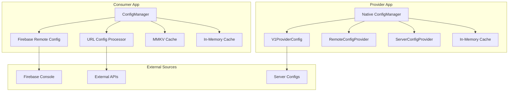
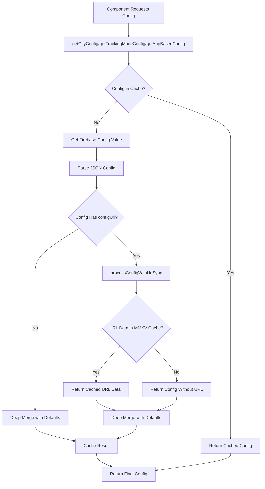
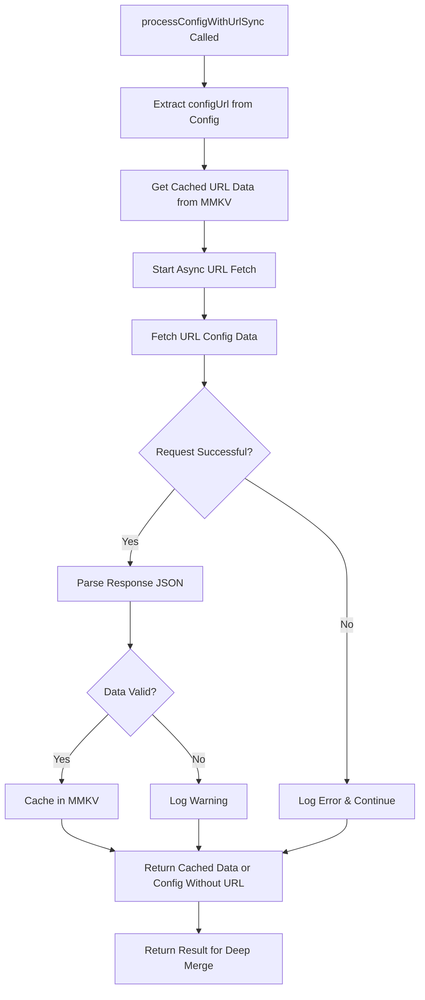
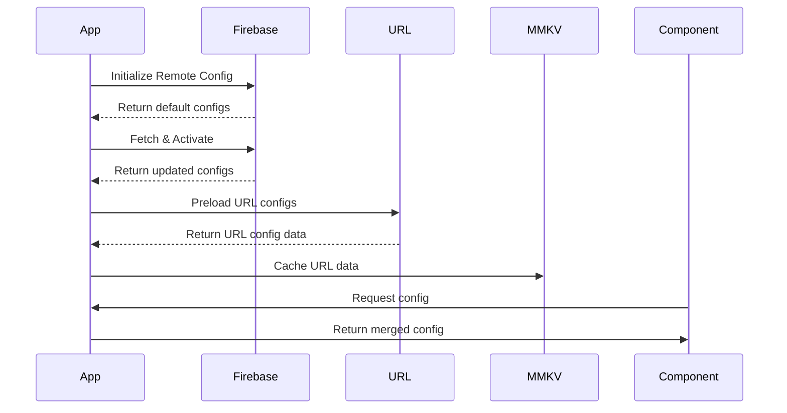

# 🎛️ Configuration System Documentation

## 📋 Table of Contents
1. [Overview](#overview)
2. [System Architecture](#system-architecture)
3. [Consumer App Configuration](#consumer-app-configuration)
4. [Provider App Configuration](#provider-app-configuration)
5. [URL Config System](#url-config-system)
6. [Data Flow Diagrams](#data-flow-diagrams)
7. [Configuration Types](#configuration-types)
8. [Usage Examples](#usage-examples)
9. [Best Practices](#best-practices)
10. [Troubleshooting](#troubleshooting)
11. [Performance Considerations](#performance-considerations)
12. [Security & Reliability](#security--reliability)

---

## 🎯 Overview

The configuration system is a multi-layered, dynamic configuration management solution that supports both Firebase Remote Config and external URL-based configurations. It provides real-time configuration updates without requiring app updates, with robust fallback mechanisms and caching strategies.

### Key Features
- ✅ **Multi-source Configuration**: Firebase Remote Config + External URLs
- ✅ **Real-time Updates**: Dynamic configuration changes without app updates
- ✅ **Robust Fallback**: Multiple fallback layers ensure app always works
- ✅ **Type Safety**: Full TypeScript support with schema validation
- ✅ **Caching**: Efficient in-memory and persistent caching
- ✅ **Cross-platform**: Works on both Consumer and Provider apps

---

## 🏗️ System Architecture

### High-Level Architecture


### Configuration Sources Priority
1. **URL Configs** (highest priority)
2. **Firebase Remote Configs**
3. **Default Configs** (fallback)
4. **Hardcoded Defaults** (last resort)

---

## 📱 Consumer App Configuration

### Core Components

#### 1. ConfigManager (`consumer/src-v2/systems/configs/configManager.ts`)
The main configuration orchestrator for the consumer app.

```typescript
export class ConfigManager {
    private provider: ConfigProvider;
    private cache: { [key: string]: any };
    private configUrlProcessor: ConfigUrlProcessor;
}
```

**Key Methods:**
- `initialize()`: Initialize the configuration system
- `getCityConfig()`: Get city-specific configurations
- `getTrackingModeConfig()`: Get tracking mode configurations
- `getAppBasedConfig()`: Get app-specific configurations
- `processConfigWithUrlSync()`: Process configs with URL overrides
- `refreshUrlConfigs()`: Manually refresh URL configs
- `clearCache()`: Clear all caches

#### 2. ConfigUrlProcessor
Handles fetching and processing of external URL configurations.

```typescript
class ConfigUrlProcessor {
    async fetchConfigFromUrl(configUrl: string): Promise<ConfigData | undefined>
    async processConfigWithUrlAndUpdateCache(configKey: string, configUrl: string): Promise<ConfigData | undefined>
}
```

#### 3. Configuration Types (`consumer/src-v2/systems/configs/types.ts`)

```typescript
export interface Configs {
    tracking_mode: Record<City, TrackingMode>;
    feature_flags: Record<TrackingMode, FeatureFlags>;
    carousel_banner_config: Record<City, CarouselBannerConfig>;
    system_configs: Record<City, SystemConfigs>;
    enabled_services: Record<City, string[]>;
    allowed_languages: Record<City, LanguageObj[]>;
    explore_section: Record<City, FamousDestProps[]>;
    support_number: Record<City, SupportNumberObj>;
    enabled_services_v2: Record<City, enabledServicesV2[]>;
    new_feature_flags: Record<City, newFeatureFlags>;
    customer_cancellation_banner_threshold: Record<City, cancellationThreshold>;
    clarity_config: Record<City, boolean>;
    contact_support: Record<appName, boolean>;
    hourly_rental: Record<City, HourlyRentalsData[]>;
    intercity_recommendations: Record<City, IntercityData[]>;
    nearby_events: Record<City, EventData>;
    nearby_drivers: NearbyDriversConfig;
    log_processor_config: Record<City, LogProcessorConfig>;
    homescreen_modules: Record<City, HomescreenModules[]>;
    rotating_text: Record<City, rotatingTexts[]>;
    boosted_rotating_text: Record<City, rotatingTexts[]>;
    use_slider_or_pill: Record<City, useSliderOrPill>;
    pledge_config: Record<City, pledgeConfig>;
    banner_popups_config: BannerPopupsConfig;
    filter_autocomplete: Record<City, boolean>;
    referral_payout_config_v2: Record<City, ReferralPayoutConfigV2>;
    driver_highlight_config: Record<City, DriverHighlightConfig>;
    dynamic_cancellation_reasons: DynamicCancellationReasonsConfig;
    tab_screens_config: Record<City, TabScreensConfig>;
    enabled_services_v3: Record<City, enabledServicesV3>;
    city_lottie_config: Record<City, LottieConfigs>;
    kapture_config: Record<City, kaptureConfig>;
    multimodal_booking_config: Record<City, multimodalBookingConfigs>;
    app_based_onboarding: Record<appName, AppBasedOnboarding>;
    app_enabled_country_configs: Record<appName, EnabledCountryConfigs>;
}
```

### Configuration Context Types

```typescript
export type ConfigKeyByContext = {
    city: CityConfigKeys;           // City-specific configs
    theme: Theme;                   // Theme-specific configs
    tracking_mode: TrackingModeConfigKeys;  // Tracking mode configs
    app: AppNameConfigKeys;         // App-specific configs
};
```

### City Configuration Keys
```typescript
export type CityConfigKeys =
    | 'tracking_mode'
    | 'system_configs'
    | 'allowed_languages'
    | 'carousel_banner_config'
    | 'enabled_services'
    | 'explore_section'
    | 'support_number'
    | 'enabled_services_v2'
    | 'clarity_config'
    | 'hourly_rental'
    | 'intercity_recommendations'
    | 'nearby_events'
    | 'new_feature_flags'
    | 'log_processor_config'
    | 'homescreen_modules'
    | 'rotating_text'
    | 'boosted_rotating_text'
    | 'use_slider_or_pill'
    | 'customer_cancellation_banner_threshold'
    | 'pledge_config'
    | 'filter_autocomplete'
    | 'referral_payout_config_v2'
    | 'tab_screens_config'
    | 'enabled_services_v3'
    | 'city_lottie_config'
    | 'multimodal_booking_config';
```

---

## 🚗 Provider App Configuration

### Core Components

#### 1. Native ConfigManager (`provider/android/app/src/main/java/in/juspay/mobility/configmanager/ConfigManager.kt`)
The native Android configuration manager for the provider app.

```kotlin
class ConfigManager private constructor(private val configProviders: List<ConfigProvider>) {
    fun getConfig(key: String, city: String? = null): WritableMap
    fun clearCache()
    fun mapToWritableMap(map: Map<String, Any>): WritableMap
    fun listToWritableArray(list: List<Any?>): WritableArray
}
```

#### 2. Configuration Providers

**V1ProviderConfig**: Legacy configuration provider
```kotlin
class V1ProviderConfig(
    private val context: Context,
    private var clearCache: (() -> Unit)? = null
) : ConfigProvider
```

**RemoteConfigProvider**: Firebase Remote Config provider
```kotlin
class RemoteConfigProvider(val clearCache: () -> Unit) : ConfigProvider, ConfigUpdateListener
```

**ServerConfigProvider**: Server-based configuration provider
```kotlin
class ServerConfigProvider(val clearCache: () -> Unit) : ConfigProvider
```

#### 3. React Native Bridge (`provider/src/turboModules/ConfigModule/ConfigModule.ts`)
```typescript
export const Config = {
    getConfig<K extends keyof ConfigType>(key: K, city?: string): ConfigType[K]
};
```

### Provider Configuration Types (`provider/src/types/config.ts`)

```typescript
export interface ConfigType {
    acExplanation: boolean;
    addFavouriteScreenBackArrow: string;
    advancedRidePopUpYoutubeLink?: string;
    allowAllMobileNumber: boolean;
    apiLoaderLottie: string;
    APP_LINK: string;
    appData: AppDataConfig;
    assets?: Record<string, string>;
    BONUS_EARNED: string;
    bottomNavConfig: BottomNavConfig;
    callDriverInfoPost?: boolean;
    cancellation_rate_thresholds?: CityBasedCancellationRateThresholdsConfig;
    cities: {
        [key: string]: CityConfigShape;
    };
    cityCode?: string;
    cityLat?: number;
    cityLong?: number;
    cityName?: string;
    clientName: string;
    currency: string;
    dashboard?: DashboardConfig;
    defaultCity: CityConfigShape;
    defaultLanguage: string;
    DOCUMENT_LINK: string;
    driver_carousel_banner_en: DriverCarouselBannerV2[];
    driver_carousel_banner_en_v2: DriverCarouselBannerV2[];
    driver_carousel_banner_kn: DriverCarouselBannerV2[];
    driver_carousel_banner_te: DriverCarouselBannerV2[];
    driver_location_intervals: DriverLocationIntervals;
    enable_otp_ride_config: CityBasedOtpRideConfig;
    enableAdvancedBooking?: boolean;
    enableGullak?: boolean;
    enableHvSdk?: boolean;
    enableMockLocation: boolean;
    enableReferral?: boolean;
    enableYatriCoins?: boolean;
    engilshInNative: string;
    feature: FeatureConfig;
    fontKannada: string;
    fontName: string;
    fontType: string;
    gotoConfig: GotoConfig;
    gradient: string[];
    gstPercentage?: string;
    imageUploadOptional: boolean;
    isGradient: string;
    languageKey?: string;
    languageList: { name: string; subtitle: string; value: string }[];
    leaderBoard: LeaderBoardConfig;
    location_update_service_trip_type_config: LocationUpdateServiceTripTypeConfig;
    logs: string[];
    mapImage?: string;
    metro_warrior_config: CityVehicleBasedMetroWarriorConfig;
    nomination_view_config: CityBasedClubConsentConfig;
    openMeter?: OpenMeterConfig;
    OTP_MESSAGE_REGEX: string;
    // ... and many more
}
```

---

## 🌐 URL Config System

### Overview
The URL Config system allows dynamic configuration updates by fetching config data from external URLs, providing real-time configuration changes without requiring app updates.

### Architecture Flow

```mermaid
graph TD
    A[App Starts] --> B[Firebase Remote Config Initialize]
    B --> C[Set Default Configs]
    C --> D[Fetch & Activate Firebase Configs]
    D --> E[ConfigManager.initialize()]
    E --> F[Provider.initialize()]
    F --> G[Provider.fetchConfigs()]
    G --> H[Preload URL Configs]
    H --> I[Scan All Firebase Config Keys]
    I --> J{Config Has configUrl?}
    J -->|Yes| K[Fetch URL Config Data]
    J -->|No| L[Skip]
    K --> M[Cache URL Data in MMKV]
    L --> N[Continue to Next Config]
    M --> N
    N --> O{More Configs?}
    O -->|Yes| I
    O -->|No| P[App Ready]
```

### Configuration with URL Structure

```typescript
interface ConfigWithUrl {
    configUrl: string | undefined;
    [key: string]: string | number | boolean | object | object[] | undefined;
}

// Example Firebase config with URL:
{
    "feature_flags": {
        "configUrl": "https://api.example.com/feature-flags.json",
        "Normal": {
            "rideToolCenter": {
                "duringPickup": {
                    "googleNavigation": true,
                    "walkDirection": false
                }
            }
        }
    }
}
```

### URL Response Structure
```typescript
// Expected response from configUrl:
{
    "Normal": {
        "rideToolCenter": {
            "duringPickup": {
                "googleNavigation": false,  // Override Firebase config
                "walkDirection": true       // Override Firebase config
            }
        }
    }
}
```

### Caching Strategy

#### Two-Level Caching System:
1. **In-Memory Cache** (ConfigManager.cache)
   - Key: `${configKey}_${city/mode/appName}`
   - Value: Final merged config
   - Lifecycle: App session

2. **Persistent Cache** (MMKV)
   - Key: `URL_CONFIG_DATA_${configKey}`
   - Value: Raw URL config data
   - Lifecycle: App install/clear

```typescript
// MMKV Storage Functions
export const setUrlConfigData = (configKey: string, data: ConfigData) => {
    const key = createUrlConfigKey(configKey);
    storage.set(key, JSON.stringify(data));
};

export const getUrlConfigData = (configKey: string): ConfigData | undefined => {
    const key = createUrlConfigKey(configKey);
    const item = storage.getString(key);
    return item ? safeJsonParse(item, {}, `MMKV_URL_CONFIG_${configKey}`) : undefined;
};
```

---

## 🔄 Data Flow Diagrams

### 1. Configuration Access Flow



### 2. URL Config Fetching Flow



### 3. Synchronization Flow



---

## 📊 Configuration Types

### 1. Feature Flags
```typescript
export type FeatureFlags = {
    rideToolCenter: {
        duringPickup: ToolCenterFlags;
        duringRide: ToolCenterFlags;
    };
    rideStartContactTrustedContacts: boolean;
    editDestination: boolean;
    postRideStartFragment: boolean;
    endRideShowFareSplit: boolean;
    favouriteDriver: boolean;
    showDriverDetailsInFeedback: boolean;
    showNeedHelpInFeedback: boolean;
    showACRidePopup: boolean;
    showDriverProfile: boolean;
    myRidesDetails?: {
        showHelpAndSupport: boolean;
        showRideDetails: boolean;
        showEstimate: boolean;
    };
    feedbackPills: {
        driverRelated: boolean;
        safetyRelated: boolean;
        fareRelated: boolean;
    };
};
```

### 2. System Configs
```typescript
export type SystemConfigs = {
    loggerConfig: {
        chunkSize: number;
        timeGranularityInMilliSec: number;
        chunksLimit: number;
        flushToDiskAfter: number;
        prodLogSeverityLevel: string;
        logFilePrefix: string;
        loggerStateKey: string;
    };
};
```

### 3. Language Configuration
```typescript
export type LanguageObj = {
    name: string;
    translatedName: string;
};

// Example:
const languages: LanguageObj[] = [
    { name: 'ENGLISH', translatedName: 'English' },
    { name: 'HINDI', translatedName: 'हिन्दी' },
    { name: 'KANNADA', translatedName: 'ಕನ್ನಡ' }
];
```

### 4. Service Configuration
```typescript
export type ServiceTag =
    | 'INTERCITY'
    | 'INSTANT'
    | 'RENTAL'
    | 'BUS'
    | 'INTERCITY_BUS'
    | 'AMBULANCE_'
    | 'TICKETING'
    | 'SCHEDULE'
    | 'BIKE_TAXI'
    | 'METRO'
    | 'DELIVERY'
    | 'METRO_V2'
    | 'SUBWAY'
    | 'BUS_V2'
    | 'NONE'
    | 'NAMMATRANSIT';

export type enabledServicesV2 = {
    serviceTag: ServiceTag;
    allowGrow: boolean;
};
```

---

## 💻 Usage Examples

### 1. Basic Config Access (Consumer)

```typescript
// Get feature flags for a city
const featureFlags = configManager.getFeatureFlags('bangalore');

// Get allowed languages for a city  
const languages = configManager.getAllowedLanguages('mumbai');

// Get app-based config
const contactSupport = configManager.getAppBasedConfig('contact_support', 'namma_yatri');

// Get tracking mode config
const trackingMode = configManager.getCityConfig('tracking_mode', 'delhi');
```

### 2. Provider Config Access

```typescript
// Get city configuration
const cityConfig = Config.getConfig('cities', 'bangalore');

// Get feature configuration
const featureConfig = Config.getConfig('feature');

// Get app data configuration
const appData = Config.getConfig('appData');
```

### 3. Manual URL Config Refresh

```typescript
// Refresh all URL configs
await configManager.refreshUrlConfigs();

// Refresh specific config
await configManager.refreshUrlConfigs('feature_flags');
```

### 4. Cache Management

```typescript
// Clear all caches (in-memory + MMKV)
configManager.clearCache();

// Clear specific cache (Provider)
ConfigManager.getInstance(context).clearCache();
```

### 5. Redux Integration (Consumer)

```typescript
// Selectors for Redux
export const selectFeatureFlags = (state: RootState) => {
    const city = selectSession(state).operatingCity;
    return configManager.getFeatureFlags(city);
};

export const selectAllowedLanguages = (state: RootState) => {
    const city = selectSession(state).operatingCity;
    return configManager.getAllowedLanguages(city);
};

export const selectSafetyHelplineNo = (state: RootState) => {
    const city = selectSession(state).operatingCity;
    return configManager.getSafetyHelplineNumber(city);
};
```

---

## 🎯 Best Practices

### 1. URL Config Design

#### ✅ Good: Override specific fields
```typescript
{
    "configUrl": "https://api.example.com/feature-flags.json",
    "Normal": {
        "rideToolCenter": {
            "duringPickup": {
                "googleNavigation": true
            }
        }
    }
}
```

#### ❌ Bad: Empty config with only URL
```typescript
{
    "configUrl": "https://api.example.com/feature-flags.json"
}
```

### 2. URL Response Design

#### ✅ Good: Complete config structure
```typescript
{
    "Normal": {
        "rideToolCenter": {
            "duringPickup": {
                "googleNavigation": true,
                "walkDirection": false,
                "safetyTools": true,
                "shareToFriends": false
            }
        }
    }
}
```

#### ❌ Bad: Partial structure
```typescript
{
    "googleNavigation": true
}
```

### 3. Error Handling

```typescript
// Always provide fallbacks
try {
    const config = configManager.getCityConfig('feature_flags', city);
    return config;
} catch (error) {
    console.error('Config error:', error);
    return defaultFeatureFlags; // Always have a fallback
}
```

### 4. Performance Optimization

```typescript
// Use selectors for Redux to prevent unnecessary re-renders
export const selectFeatureFlags = createSelector(
    [selectOperatingCity],
    (city) => configManager.getFeatureFlags(city)
);
```

---

## 🔧 Troubleshooting

### Common Issues

#### 1. "target is not an object" Error
**Cause**: `processConfigWithUrlSync` returning `undefined`
**Solution**: Ensure URL config data is properly cached or fallback to config without URL

#### 2. Config Not Found
**Cause**: Missing default configs
**Solution**: Add appropriate default configs in `defaultConfig.ts`

#### 3. URL Config Not Loading
**Cause**: Network issues or invalid URL
**Solution**: Check network connectivity and URL validity

#### 4. Cache Issues
**Cause**: Stale cache data
**Solution**: Clear cache using `configManager.clearCache()`

### Debug Logs

```typescript
// Enable debug logging
console.info(`Processing config with URL for key: ${key}, city: ${city}`);
console.warn(`Invalid processedConfig for ${key}, falling back to parsed config`);
console.error(`Failed to fetch config from ${configUrl}:`, error);
console.error(`Config parse error for "${key}":`, error);
```

### Monitoring

```typescript
// Monitor config loading performance
const startTime = Date.now();
const config = configManager.getCityConfig('feature_flags', city);
const loadTime = Date.now() - startTime;
console.info(`Config load time: ${loadTime}ms`);
```

---

## ⚡ Performance Considerations

### 1. Startup Performance
- **With Preloading**: Slower startup, all URL configs fetched upfront
- **Without Preloading**: Faster startup, URL configs fetched on-demand

### 2. Memory Usage
- In-memory cache: ~1-5MB depending on config size
- MMKV cache: ~100KB-1MB for URL config data

### 3. Network Usage
- Firebase configs: ~50-200KB per app session
- URL configs: ~10-50KB per config (cached)

### 4. Optimization Strategies

```typescript
// Lazy loading for non-critical configs
const loadConfigOnDemand = async (key: string) => {
    if (!configCache[key]) {
        configCache[key] = await fetchConfig(key);
    }
    return configCache[key];
};

// Batch config requests
const batchConfigRequests = async (keys: string[]) => {
    return Promise.all(keys.map(key => loadConfigOnDemand(key)));
};
```

---

## 🛡️ Security & Reliability

### 1. Error Recovery
```typescript
// Multiple fallback layers:
1. URL config data (if available)
2. Firebase config data (if available)  
3. Default config data (always available)
4. Hardcoded defaults (last resort)
```

### 2. Data Validation
```typescript
// All configs validated against schema
const result = schema.validate(data);
return result.success ? result.value : fallback;
```

### 3. Network Resilience
```typescript
// Timeout handling
const fetchWithTimeout = async (url: string, timeout = 5000) => {
    const controller = new AbortController();
    const timeoutId = setTimeout(() => controller.abort(), timeout);
    
    try {
        const response = await fetch(url, { signal: controller.signal });
        clearTimeout(timeoutId);
        return response;
    } catch (error) {
        clearTimeout(timeoutId);
        throw error;
    }
};
```

### 4. Security Considerations

```typescript
// Validate URL schemes
const isValidUrl = (url: string) => {
    try {
        const parsed = new URL(url);
        return ['https:', 'http:'].includes(parsed.protocol);
    } catch {
        return false;
    }
};

// Sanitize config data
const sanitizeConfig = (data: any) => {
    // Remove potentially dangerous properties
    const { __proto__, constructor, ...safeData } = data;
    return safeData;
};
```

---

## 📈 Monitoring & Analytics

### 1. Config Usage Metrics
```typescript
// Track config access patterns
const trackConfigAccess = (key: string, city: string) => {
    analytics.track('config_accessed', {
        key,
        city,
        timestamp: Date.now(),
        source: 'firebase' | 'url' | 'default'
    });
};
```

### 2. Performance Metrics
```typescript
// Monitor config load times
const measureConfigLoadTime = async (key: string) => {
    const start = performance.now();
    const config = await loadConfig(key);
    const duration = performance.now() - start;
    
    analytics.track('config_load_time', {
        key,
        duration,
        success: !!config
    });
};
```

### 3. Error Tracking
```typescript
// Track configuration errors
const trackConfigError = (error: Error, context: string) => {
    Sentry.captureException(error, {
        tags: { 
            component: 'config_manager',
            context 
        },
        extra: { 
            errorType: error.name,
            errorMessage: error.message
        }
    });
};
```

---

## 🔄 Migration Guide

### From Static Configs to Dynamic Configs

1. **Identify Static Configs**
```typescript
// Before: Hardcoded configs
const FEATURE_FLAGS = {
    enableNewFeature: true,
    showBanner: false
};
```

2. **Move to Firebase Remote Config**
```typescript
// After: Dynamic configs
const featureFlags = configManager.getFeatureFlags(city);
```

3. **Add URL Override Support**
```typescript
// Enhanced: URL override support
{
    "feature_flags": {
        "configUrl": "https://api.example.com/feature-flags.json",
        "Normal": {
            "enableNewFeature": true
        }
    }
}
```

### From Provider V1 to V2 Configs

1. **Update Config Structure**
2. **Migrate Default Configs**
3. **Update Config Access Patterns**
4. **Test Fallback Mechanisms**

---

## 📚 Additional Resources

### Documentation
- [Firebase Remote Config Documentation](https://firebase.google.com/docs/remote-config)
- [React Native MMKV Documentation](https://github.com/mrousavy/react-native-mmkv)
- [TypeScript Configuration](https://www.typescriptlang.org/docs/)

### Related Files
- `consumer/src-v2/systems/configs/` - Consumer configuration system
- `provider/src/turboModules/ConfigModule/` - Provider configuration system
- `provider/android/app/src/main/java/in/juspay/mobility/configmanager/` - Native Android configs
- `libs/config-types/` - Shared configuration types

### Support
- For technical issues: Check the troubleshooting section
- For feature requests: Create an issue in the repository
- For urgent issues: Contact the development team

---

## 📝 Changelog

### Version 2.0.0
- Added URL config support
- Implemented two-level caching system
- Added comprehensive error handling
- Improved type safety with TypeScript

### Version 1.5.0
- Added Firebase Remote Config integration
- Implemented in-memory caching
- Added configuration validation

### Version 1.0.0
- Initial release with static configuration support
- Basic provider and consumer configuration systems

---

*This documentation is maintained by the development team. For questions or contributions, please refer to the repository guidelines.*
